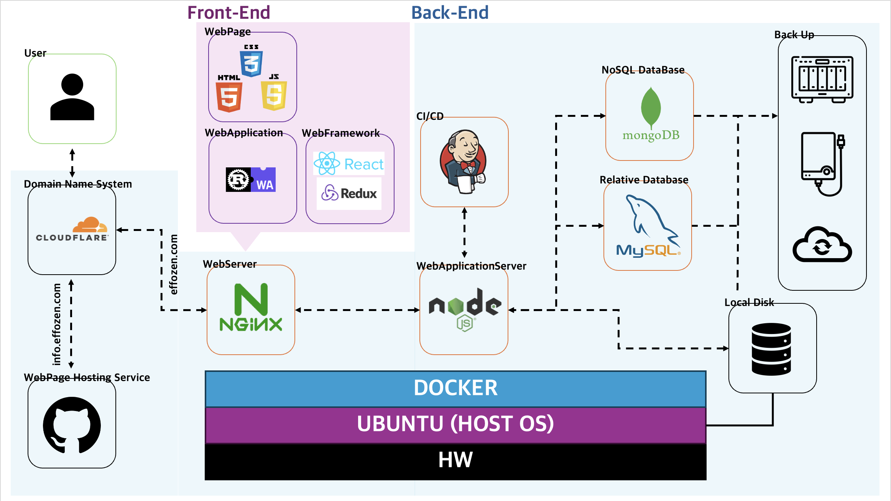

# 💡 Effozen의 web site front-end 개발 리포지토리 💡

## 🚀 개요 🚀
개인 웹사이트를 운영하기 위한 Front-End 소스코드를 담은 리포지토리입니다.
아래와 같은 내용이 포함이 됩니다.
  - 자기소개
  - 개인 커리어 이력
  - 개인 프로젝트
  - 지식 공유

## 🚀 구현 방안 🚀
해당 소스들을 구현하기 위해서 다음과 같은 방법을 채택합니다.

확장성을 위해 MSA(Micro Service Architecture) 형태 구현을 지향하며, 개별적인 프로젝트에 대한 Front-End 빌드 내용들이 통합되어 제공됩니다.
(각각의 개별 프로젝트에 대한 내용은 추후 추가될 시 별도의 깃 리포지토리를 통해서 확인할 수 있을 예정입니다.)

본 리포지토리는 위 로직 중 Jenkins를 통한 CI/CD를 위해 첨부하는 내용입니다.

개발 내용은 Dev 브랜치에 올라가며, 빌드가 완료된 요소에 한해서 Main 브랜치에 업로드가 됩니다.

별도의 개발은 다른 리포지토리에서 진행되며, 해당 내용은 build 된 요소들에 대해서 다룹니다.
(React의 public 폴더)
